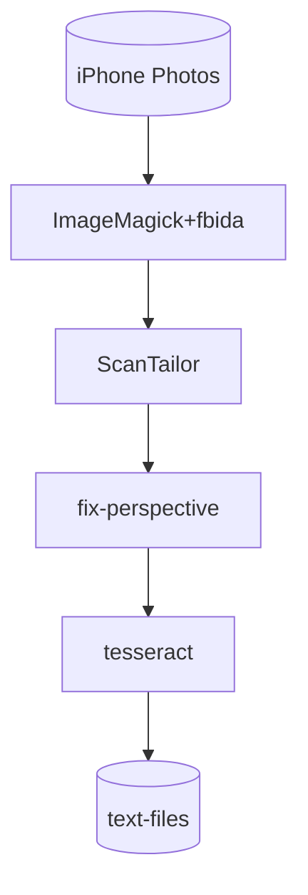

# my-book-scan-pipeline

I was presented with the challenge of ocr'ing a novel to obtain a digital
version for academic analysis reasons and wanted to share the pipeline I put
together to process a set of hand taken iPhone photos of the book pages and
produce a set of text files representing each photo.

This is the result of some very hasty quick research so it could probably be
improved greatly. However I'm fairly satisfied on the return on investment for
a few hours of investigation work and I think this could save someone else time
if they are trying to do something similar.

Now before you ask, yes, you can use an ocr app on the phone which probably has
significantly better results than this pipeline but I felt it's nicer to be able
to do a mass post-process on a laptop rather than trying to export all the data
from the phone out per page.

Warning: This is not a refined production grade piece of software. It is a
quickly glued together set of open source tools I found that could ocr some
iPhone pictures of a novel taken by hand without the book spine being cut.

There is no configurability or flexibility built-in. The glue is a trivial
Python script with no tests. Use at your own risk!

# Pipeline

The pipeline is designed to take as input a directory of iPhone photos in the
HEIC format (essentially exif), apply some image pre-processing to improve the
odds of the ocr process succeeding, and run tesseract to do the ocr process.

For preprocessing, the following steps are applied:

1. The HEIC images are pushed through [imagemagick](https://imagemagick.org/index.php)
   and [fbida](https://www.kraxel.org/blog/linux/fbida/) to resize, rotate, and
   convert to jpeg.

2. The jpeg files are then fed into a tool called [scantailor](https://scantailor.org/).
   This tool cleans up the images into cropped, high contrast images with the
   aim to focus on the content of the novel page.

3. The output of scantailor is then fed into a tool called [fix-perspective](https://github.com/jbarth-ubhd/fix-perspective.git)
   which is a tool to *"compensate perspective distortion in document images"*
   (aka attempt to deskew the text).

Finally the results of the pre-processing are fed into [tesseract](https://github.com/tesseract-ocr/tesseract)
to do the ocr process. The tessdata_best training set is used to improve the
quality of the ocr and the language and psm explicitly set (using the default
`3` psm value as I found it worked best for my data set).

The result of the pipeline is a directory containing text files that align with
the original images.



# Usage

In the git repository you can find the Containerfile (aka Dockerfile) that
sets up the environment to run the pipeline in.

1. Build the container image

```
git clone https://github.com/michael131468/my-book-scan-pipeline.git
cd my-book-scan-pipeline
podman build -t scanner:latest .
```

2. Then spawn a container and mount your images you want to process and the
   output directory to store the results.

```
mkdir -p output
podman run --rm -v ./sample-image:/originals -v ./output:/output -it scanner:latest /bin/bash
```

3. Execute /script.py in the container shell

```
# /script.py
Processing originals/IMG_9211.HEIC to jpeg
Running scantailor
Running fix-perspective
Running tesseract
Produced: output/pages/IMG_9211.HEIC.txt
```

4. Exit the container with `exit`

```
# exit
exit
```

The results of the script can be found in the output directory.

```
output/
├── images
│   └── IMG_9211.jpeg
├── pages
│   └── IMG_9211.HEIC.txt
└── scantailored
    ├── cache
    │   └── speckles
    │       └── IMG_9211.tif
    └── IMG_9211.tif
```

The resized, rotated and jpeg converted image can be found in the images
subdirectory.

The scantailored/fix-perspective output is the resulting tif image file in the
scantailored subdirectory.

The ocr results of tesseract are in the pages subdirectory.

# Results

I found the following results after scanning a 180+ page novel:

- Fairly good but definitely not perfect
- Misaligned words attribute to wrong lines (due to page curvature)
  - This could corrupt entire scans if the page was too greatly curved
- Some characters misinterpreted (eg. T for I).
- Some blemishes on the pages (dust, ink, etc) were converted to random
  punctuation

Overall, it produced a good starting point to save time but manual clean up
was still needed. But the amount of time saved was significant for a book with
no digital version available.

# Example Data: sample-image and output

I included a sample image of a page from the Great Gatsby (which should hopefully
pose no copyright issues or licensing issues as it is in the public domain).

I also include the corresponding output of the script in the output directory.
See the usage section above for details on the output structure.
